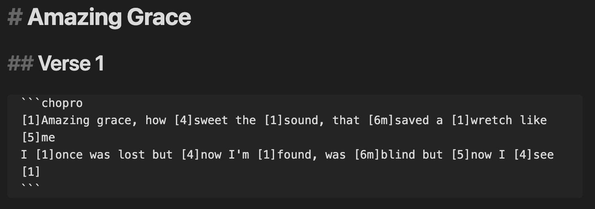
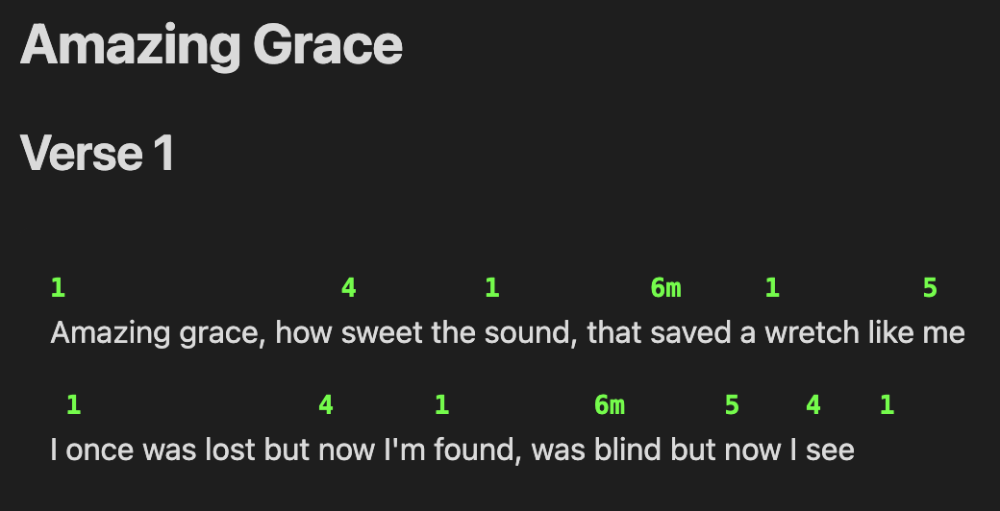

# ChoPro Plugin for Obsidian

An Obsidian plugin that renders ChordPro format chord sheets with accurate chord positioning above lyrics.



... becomes ...



## Features

- **Accurate Chord Positioning**: Improved algorithm for precise chord-to-lyric alignment
- **Configurable Styling**: Customizable chord color, directive display
- **Chord Normalization**: Automatic cleanup and standardization of chord notation
- **Transpose Files**: Transpose entire files between keys or chord notations

## Usage

Create a code block with the `chopro` language identifier:

````markdown
```chopro
[C]Amazing [F]grace how [G]sweet the sound
That [C]saved a [Am]wretch like [F]me[G]
[C]I once was [F]lost but [G]now am found
Was [C]blind but [Am]now I [F]see[C]
```
````

## Commands

These actions are available using the Command Palette.

- **Transpose chords in current file**: open the transpose dialog for the current file
- **Insert flow content from file**: insert song flow content from files with flow properties

## Flow Content

The plugin supports a powerful flow system for organizing and reusing song content across different files. This feature allows you to define the structure of a song in one file and then insert that flow into other documents.

### Setting Up Flow Files

Add a `flow` property to your song files' frontmatter. The flow can be either a string or an array:

#### String Flow

```yaml
---
title: Simple Song
flow: "This is direct content to insert"
---
```

#### Array Flow

```yaml
---
title: Amazing Grace
flow:
    - "#Verse 1"
    - "#Verse 2"
    - "#Verse 3"
    - "#Verse 4"
---
```

### How Flow Works

When you use the "Insert flow content from file" command:

1. **Section References**: Items starting with `#` create transclusion links to sections in the selected file
    - `"#Verse 1"` becomes `![[filename#Verse 1]]`
    - These will display the actual section content inline

2. **Direct Content**: Items not starting with `#` are inserted as literal text
    - `"Repeat chorus twice"` is inserted exactly as written

Only files containing a `flow` property in their frontmatter will appear in the file selector.

## Configuration

Access settings via Settings → Community Plugins → ChordPro Viewer:

- **Chord Color**: Set the color for chord text (CSS color value, default: `#2563eb`)
- **Chord Size**: Font size for chord text (CSS size value, default: `1em`)
- **Superscript Chord Modifiers**: Display chord modifiers (7, maj7, sus4, etc.) as superscript
- **Chord Decoration**: Wrap chords with bracket pairs for emphasis (None, [ ], ( ), { }, < >)
- **Italic Annotations**: Display annotations (text starting with asterisk) in italics
- **Song Folder**: Limit song file selection to a specific folder (e.g., "Songs/")

The settings panel includes a live preview that updates as you change configuration options.

## Supported ChordPro Features

### Chords

- **Basic chords**: `[C]`, `[F]`, `[G]`, `[Am]`, etc.
- **Complex chords**: `[Am7]`, `[Bmaj7]`, `[C#dim]`, `[F/A]`, `[Gsus4]`
- **Nashville numbers**: `[1]`, `[4]`, `[5]`, `[6m]`, `[1maj7]`, `[5/7]`, etc.
- **Multiple consecutive chords**: `[C][F][G]` or `[1][4][5]`
- **Chords at any position**: Beginning, middle, or end of lines
- **Chord modifiers**: Support for superscript display of extensions (7, maj7, sus4, etc.)

### Annotations

- **Performance markings**: `[*Rit.]`, `[*Forte]`, `[*Andante]`
- **Dynamic markings**: `[*pp]`, `[*ff]`, `[*Crescendo]`
- **Structural annotations**: `[*Fine]`, `[*D.C. al Fine]`, `[*Begin softly]`
- **Configurable styling**: Toggle italic display for all annotations

## Installation

### Manual Installation

1. Download the latest release files from the GitHub repo.
2. Unzip the release file in your vault's `.obsidian/plugins/` directory
3. Enable the plugin in Settings → Community Plugins

### Development Installation

1. Clone this repository into your vault's `.obsidian/plugins/` directory
2. Run `npm install` to install dependencies
3. Run `npm run dev` for development with hot reload
4. Run `npm run build` for production build

### BRAT

1. Add this repo to your [BRAT](https://github.com/TfTHacker/obsidian42-brat) plugin list.
2. Enable the plugin in Settings → Community Plugins

## License

MIT License - see LICENSE file for details

## Support

If you encounter any issues or have feature requests, please open an issue on the [GitHub repository](https://github.com/jheddings/obsidian-chopro/issues).
